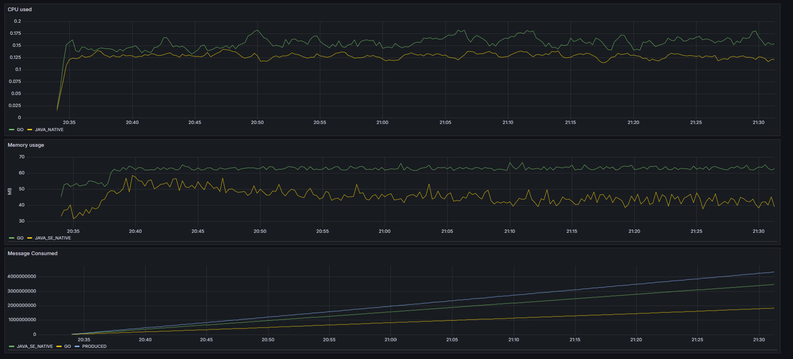

# Kafka benching

This project aims to look how quickly messages can be consumed from various client libs

At the moment the set up is

Kafka Producer

* Java Se Native using Apache client depdencies and using GRAALVM to go native

Kafka clients

* Go using Confluent Kafka Client Api ( note building on Windows is not supported yet )
* Java SE using Apache Client Api and Graalvm to go native 

---

## Getting Started 

The setup uses Docker Compose for kafka and load setup

Building images:

1. In WSL 2
    
    run commands

        source ./tools.sh
        buildImages
        <!-- The buildImages likley to take time, Java projects  pulls down images with tools to build native images  -->

2. In a Windows host cmd

    run commands

        docker compose --profile startup up -d

3. Go to the Grafana dashboard at

        localhost:3000
        credentials are located in the docker compose

4. Import the preconfigured dashboard found at

    project_root/grafana_work_done_dashboard.json

5. Let things run, the dashboard should populate

---

### Below is a Grafana hour long run Result 

